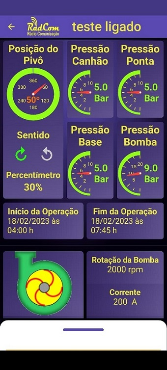
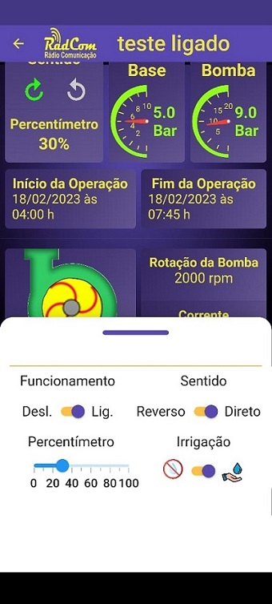
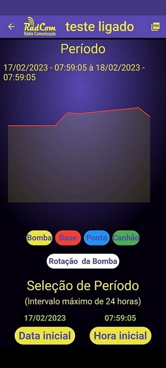
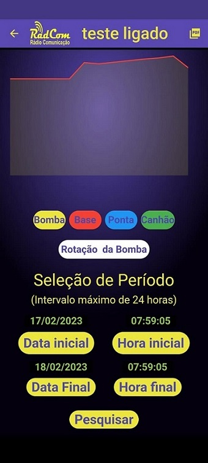
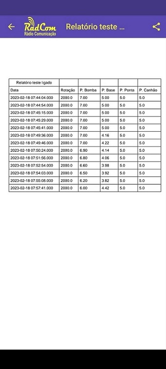

#  Radcom Rádio Comunicação Ltda

​	Este arquivo é a apresentação de um aplicativo nomeado Sentinela II que foi criado para  a Empresa Radcom Rádio Comunicação de Barretos - SP.

​	Nesta data, 18/02/2023, encontra-se em produção, disponível na loja Android.

​	O aplicativo Radcom foi criado por meio da tecnologia Dart/Flutter com o propósito de realizar monitoramento de pivôs agrícolas. 

​	Atualmente além de monitorar, é capaz de proporcionar controle sobre algumas partes, como por exemplo ligar/desligar, quantidade de água a ser lançada, ativar/desativar a água e trocar o sentido de giro do pivô.

​	Veja abaixo algumas telas e explicações adicionais.

​	Abaixo estão as telas de entrada, e login:

 

​	Logo após a realizaçãodo login, o usuário chega na lista de propriedades que possui, ao escolher a propriedade, recebe a lista de equipamentos instalados nesta propriedade.

​	A lista de equipamentos trás algumas informações básicas em tempo real, e a situação do equipamento, se ligado(verde), desligado(violeta) ou         com problemas (vermelho), sendo que é possível identificar os problemas mais comuns.

 

​	Abaixo, há o painel de visualização de um equipamento específico.

​	Esta visualização mostra todas as informações que é possível obter do equipamento instalado. Todas as informações são trazidas em tempo real         e há também mudança nas cores de verde, para violeta ou vermelho, a depender do estado do pivô ou das pressões. Se uma determinada pressão abaixa ou sobe além do escopo definido, seu mostrador torna-se vermelho e uma mensagem é enviada aos responsáveis.

 

​	Além disso é possível alterar o funcionamento do pivô, como mostrado abaixo, e também obter um gráfico das pressões, podendo inclusive fazer comparações entre elas e gerar relatório, enviando-o por vários serviços de mensageria.

 

 

​	

​															                                                                                  		 **Lindomar Farineli**